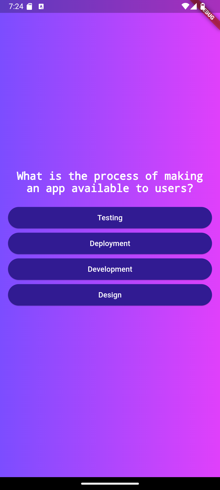
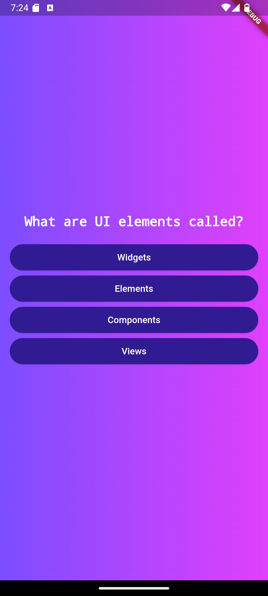
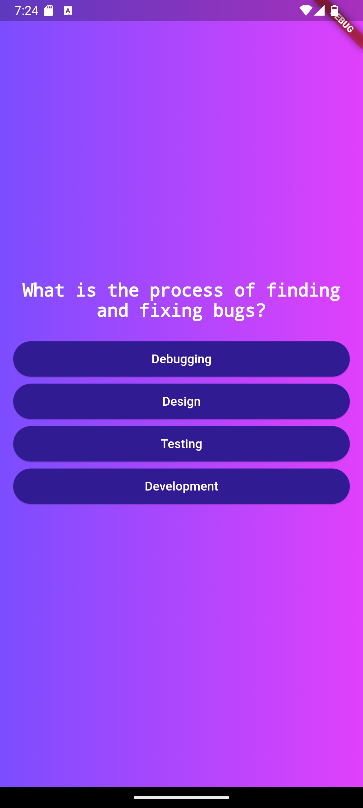
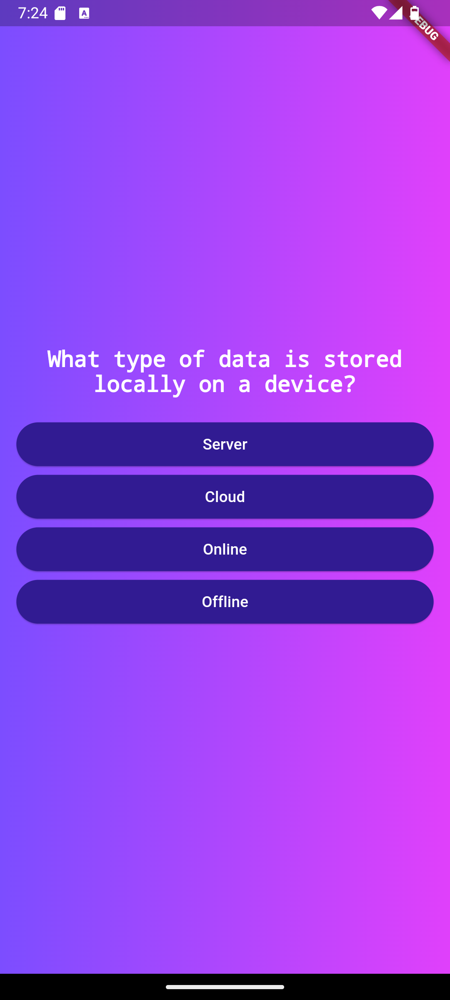
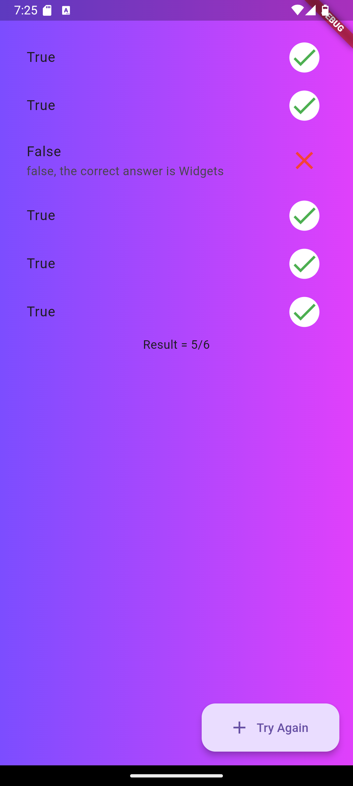
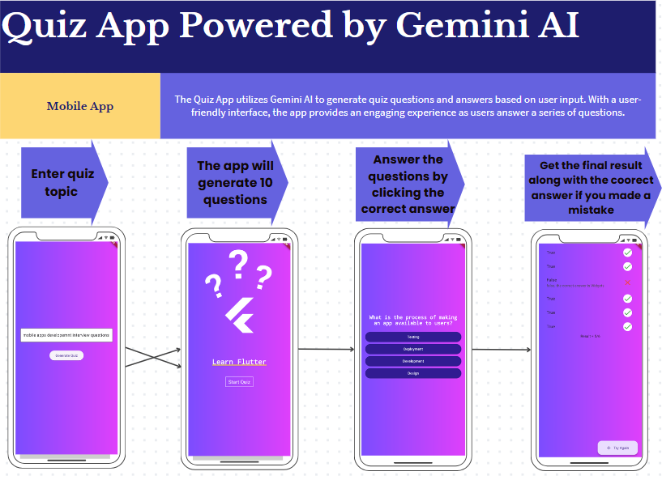

#  Quiz App Powered by Gemini AI

## Overview
The Quiz App utilizes Gemini AI to generate quiz questions and answers based on user input. With a user-friendly interface, the app provides an engaging experience as users answer a series of questions. This app is designed to make learning fun and interactive, offering instant feedback on performance.

## Features
- **Gemini AI Integration**: Custom prompts are used to generate quiz content, ensuring a diverse range of questions.
- **Dynamic Question Extraction**: Regular expressions are employed to extract quiz questions and their options effectively.
- **User-Friendly Interface**: The app presents quiz options as buttons, allowing for easy navigation and selection.
- **Shuffled Options**: Each question's options are shuffled to enhance the quiz experience and minimize answer prediction.
- **Instant Feedback**: At the end of the quiz, users receive results indicating which answers were correct or incorrect, along with the correct answers.
- **Score Display**: Users see their total score (e.g., 10/10) at the end of the quiz, fostering a sense of achievement.

## 📸 Screenshots

<div align="center">
  <table style="width: 100%; border-collapse: collapse;">
    <tr>
      <td width="33.33%" align="center">
        <br/>
        <b>Landing Page</b>
      </td>
      <td width="33.33%" align="center">
        <br/>
        <b>Quiz Initialization</b>
      </td>
      <td width="33.33%" align="center">
        <br/>
        <b>Quiz Generation</b>
      </td>
    </tr>
    <tr>
      <td width="33.33%" align="center">
        <br/>
        <b>Question 1</b>
      </td>
      <td width="33.33%" align="center">
        <br/>
        <b>Question 2</b>
      </td>
      <td width="33.33%" align="center">
        <br/>
        <b>Question 3</b>
      </td>
    </tr>
    <tr>
      <td width="33.33%" align="center">
        <br/>
        <b>Question 4</b>
      </td>
      <td width="33.33%" align="center">
        <br/>
        <b>Quiz Results</b>
      </td>
      <td width="33.33%" align="center">
        <br/>
        <b>App Poster</b>
      </td>
    </tr>
  </table>
</div>

<p align="center"><i>For a full view of all application screens</i></p>

## How It Works
1. **Title Input**: Users enter a title for their quiz, which initializes the quiz session.
2. **Question Generation**: The app queries Gemini AI using customized prompts to retrieve relevant quiz questions.
3. **Option Extraction**: Regular expressions extract options for each question, with the correct answer designated as the first option.
4. **Shuffling Options**: The app shuffles the answer options to provide variety in each quiz attempt.
5. **User Interaction**: Users navigate through 10 questions, selecting their answers by clicking buttons.
6. **Result Display**: Upon completion, users are presented with a result card that shows the correct answers, marks, and their total score.

## Technologies Used
- **Gemini AI**: For generating quiz content.
- **Dart & Flutter**: For building a responsive UI and managing app logic.
- **Regular Expressions**: For extracting questions and answers effectively.

## API Setup
To use this app, you must provide your own API key for Gemini AI. Follow these steps:
1. Obtain your API key from the Gemini AI service.
2. Add your API key to the project configuration file (e.g., `.env` or similar) as instructed in the documentation.

## Getting Started
1. Clone the repository:
   ```bash
   git clone https://github.com/YourUsername/Quiz-App.git
